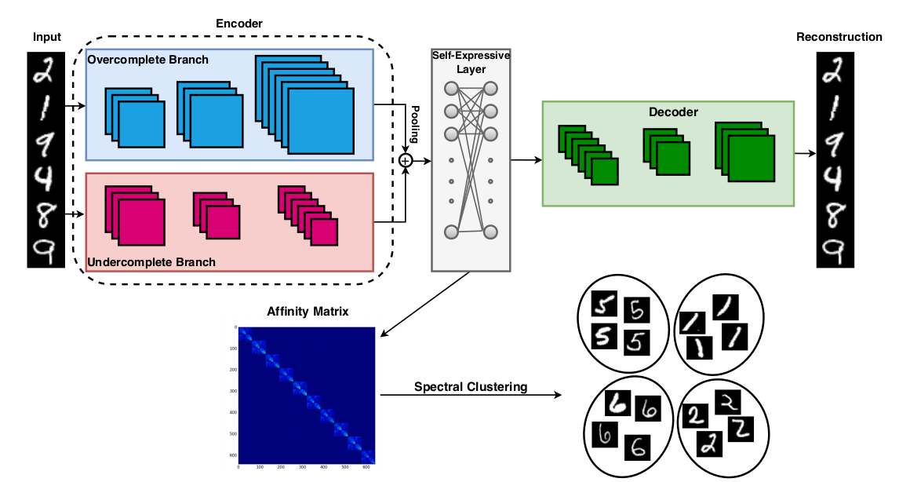

# Overcomplete-Deep-Subspace-Clustering
Official Tensorflow Code for the paper "Overcomplete Deep Subspace Clustering Networks" - WACV 2021

<a href="https://arxiv.org/abs/2006.04878"> Paper </a> 


# Introduction:

Deep Subspace Clustering Networks (DSC) provide an efficient solution to the problem of unsupervised subspace clustering by using an undercomplete deep auto-encoder with a fully-connected layer to exploit the self expressiveness property. This method uses undercomplete representations of the input data which makes it not so robust and more dependent on pre-training. To overcome this, we propose a simple yet efficient alternative method - Overcomplete Deep Subspace Clustering Networks (ODSC) where we use overcomplete representations for subspace clustering. In our proposed method, we fuse the features from both undercomplete and overcomplete auto-encoder networks before passing them through the self-expressive layer thus enabling us to extract a more meaningful and robust representation of the input data for clustering. Experimental results on four benchmark datasets show the effectiveness of the proposed method over DSC and other clustering methods in terms of clustering error. Our method is also not as dependent as DSC is on where pre-training should be stopped to get the best performance and is also
more robust to noise.

<p align="center">
  
</p>

## About this repo:

This repo hosts the code for ODSC method for subspace clustering. It contains code and hyperparameters tuned for the following datasets:

1) MNIST - <a href="http://yann.lecun.com/exdb/mnist/"> Link </a>
2) ORL - <a href="https://cam-orl.co.uk/facedatabase.html"> Link </a>
3) COIL20 - <a href="https://www.cs.columbia.edu/CAVE/software/softlib/coil-20.php"> Link </a>
4) YaleB - <a href="http://vision.ucsd.edu/~leekc/ExtYaleDatabase/ExtYaleB.html"> Link </a>

All these datasets have been included in the Data folder as .mat files for easy usage. 

### Prerequisites

- Python 3.6
- Tensorflow 1.14
- munkres
- sklearn

## Using the Code:

- Clone this repository:
```bash
git clone https://github.com/jeya-maria-jose/Overcomplete-Deep-Subspace-Clustering
cd Overcomplete-Deep-Subspace-Clustering
```

- The codes for each dataset has been organized into separate folders <code> MNIST, COIL20, ORL and EYaleB </code>.

- The pretrained models can be found for each dataset: <code> dataset_name/pretrained/ </code>

- To do the pretraining yourself, run the pretraining code found in each dataset folder <code> dataset_name/pretrain_ODSC.py </code>

### Fine-tuning

To perform fine-tuning, just run the <code> ODSC_x.py </code> code found under each dataset folder where x is the dataset name.

For example, for fine-tuning and checking the error for MNIST dataset, do the following:

```bash
cd MNIST/
python ODSC-mnist.py
```

### Acknowledgement:

This code is developed on top of [Pan Ji's](https://github.com/panji1990) [DSC](https://github.com/panji1990/Deep-subspace-clustering-networks).

## Citation:

```bash
@article{valanarasu2020overcomplete,
  title={Overcomplete Deep Subspace Clustering Networks},
  author={Valanarasu, Jeya Maria Jose and Patel, Vishal M},
  journal={arXiv preprint arXiv:2011.08306},
  year={2020}
}
```

Open an issue in case of any queries.

